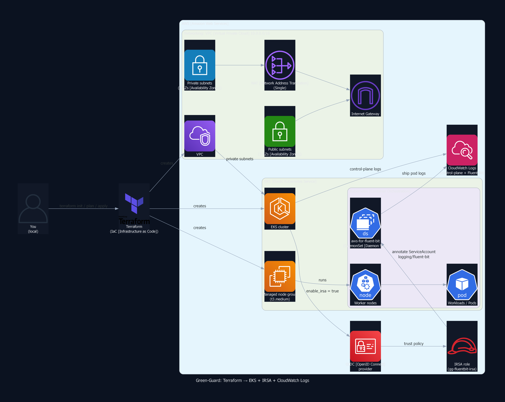

# gg-eks-terraform

Provision an **EKS** platform using **Terraform**, then optionally add **Fluent Bit [Log shipper] → CloudWatch Logs [Amazon CloudWatch Logs]** with **IRSA** and run a **HPA + PDB** reliability demo.

## 🎯 What this builds
* **VPC** with **public** and **private** subnets
* **NAT Gateway** for private subnet egress
* **EKS** control plane
* **EKS** managed node group (worker nodes)
* **OIDC** provider + **IRSA** enabled
* **Control plane logs** to **CloudWatch Logs [Amazon CloudWatch Logs]**
* Optional: **Fluent Bit [Log shipper]** shipping cluster logs to **CloudWatch Logs**
* Optional: **Reliability demo** using **HPA** and **PDB**

## 🧠 Architecture
[](docs/diagrams/gg-eks-terraform-arch.png)


* **Diagram (PNG [Portable Network Graphics])**: **[docs/diagrams/gg-eks-terraform-arch.png](docs/diagrams/gg-eks-terraform-arch.png)**


## 📍 Environment (demo values used here)
* **AWS [Amazon Web Services] Region**: `us-east-2`
* **AWS CLI profile**: `gg`
* **cluster_name** default: `gg-eks-p7` (from **variables.tf**)
* If you want `green-guard-gg-eks`, apply with: `-var="cluster_name=green-guard-gg-eks"`

## ✅ Prerequisites
* **AWS CLI** configured with a profile named `gg`
* **Terraform**
* **kubectl**
* **Helm** (only for Fluent Bit [Log shipper] add on)

## 📦 Repo structure (source of truth)
* **[main.tf](main.tf)**: VPC [Virtual Private Cloud] + EKS [Elastic Kubernetes Service] resources
* **[variables.tf](variables.tf)**: inputs (cluster name, sizes, etc.)
* **[versions.tf](versions.tf)**: provider + version pins
* **[outputs.tf](outputs.tf)**: useful outputs after apply
* **[scripts/apply.sh](scripts/apply.sh)** and **[scripts/destroy.sh](scripts/destroy.sh)**: quick apply and destroy
* **[manifests/irsa/](manifests/irsa/)**: IRSA [IAM Roles for Service Accounts] trust and policy JSON [JavaScript Object Notation]
* **[fluentbit-values.yaml](fluentbit-values.yaml)**: Helm [package manager] values for Fluent Bit [Log shipper]
* **[docs/screenshots/](docs/screenshots/)**: proof screenshots
* **[docs/evidence.md](docs/evidence.md)**: extra proof notes
* **[reliability/](reliability/)**: HPA [Horizontal Pod Autoscaler] + PDB [Pod Disruption Budget] demo manifests + screenshots


## 🚀 Deploy (Terraform [Infrastructure as Code])
### 1) Init and apply
```bash
terraform init
terraform plan
terraform apply
```

## 🧾 Evidence table (claim → proof)
| Claim | Proof (click) |
| --- | --- |
| Terraform apply completed | [terraform-apply-complete.png](docs/screenshots/terraform-apply-complete.png) |
| Worker nodes Ready | [kubectl-get-nodes.png](docs/screenshots/kubectl-get-nodes.png) |
| Core system pods running | [kube-system-pods.png](docs/screenshots/kube-system-pods.png) |
| CloudWatch Logs [Amazon CloudWatch Logs] log groups visible | [p8-logging-01-log-groups.png](docs/screenshots/p8/p8-logging-01-log-groups.png) |
| CloudWatch Logs [Amazon CloudWatch Logs] log streams visible | [p8-logging-02-log-streams.png](docs/screenshots/p8/p8-logging-02-log-streams.png) |
| Sample log event visible | [p8-logging-03-stream-sample.png](docs/screenshots/p8/p8-logging-03-stream-sample.png) |
| Fluent Bit [Log shipper] output config shown | [p8-logging-04-configmap-output.png](docs/screenshots/p8/p8-logging-04-configmap-output.png) |
| Fluent Bit [Log shipper] rollout OK | [p8-logging-05-rollout-ok.png](docs/screenshots/p8/p8-logging-05-rollout-ok.png) |
| No AccessDenied (IRSA working) | [p8-logging-06-fluentbit-no-denied.png](docs/screenshots/p8/p8-logging-06-fluentbit-no-denied.png) |
| ServiceAccount [Kubernetes identity] annotated (IRSA [IAM Roles for Service Accounts]) | [p8-logging-07-sa-irsa.png](docs/screenshots/p8/p8-logging-07-sa-irsa.png) |
| Helm [package manager] values proof | [p8-logging-08-helm-values.png](docs/screenshots/p8/p8-logging-08-helm-values.png) |
| Metrics Server [Kubernetes metrics] ready | [p8-metrics-server-ready.png](reliability/screenshots/p8-metrics-server-ready.png) |
| HPA scaling observed | [p8-hpa-scaling.png](reliability/screenshots/p8-hpa-scaling.png) |
| PDB created | [p8-pdb.png](reliability/screenshots/p8-pdb.png) |
| Self heal proof | [p8-self-heal.png](reliability/screenshots/p8-self-heal.png) |
| Self heal confirmed | [p8-self-heal-confirmed.png](reliability/screenshots/p8-self-heal-confirmed.png) |


## 🔎 Verify (cluster is healthy)
```bash
kubectl get nodes
kubectl get pods -n kube-system
